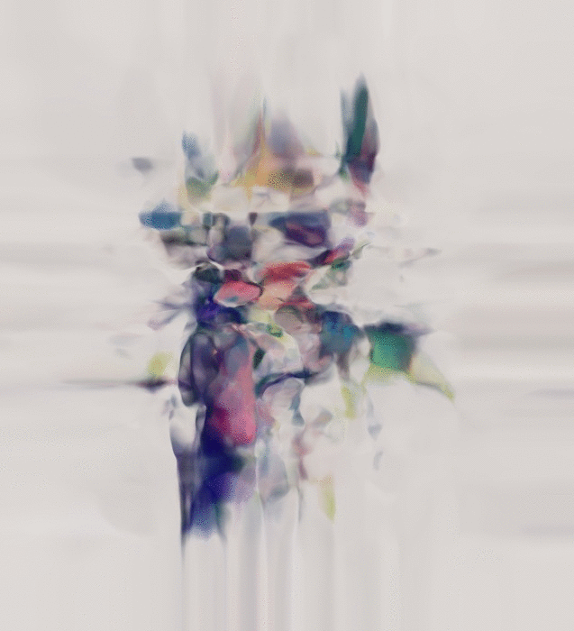

### Gifs instead of introduction

### Minimal example for predicting rgb from coordinates
Basically, thats it, we will train neural net to predict color from pixel coordinate: (x,y)->(r,g,b). Another fancy name for that kind of problem is regression problem.

My first step was to reproduce [hardmaru's](http://twitter.com/hardmaru) [work](http://blog.otoro.net/2016/03/25/generating-abstract-patterns-with-tensorflow/) with CPPN.
Lets define network which takes two inputs and gives three outputs. This would be our minimal example.

But this is not particulary intresting one, because we drawing picture that we already have without adding anything interesting to it. 

### Bit more complex
It may be useful to add third, excessive, input R - distance from pixel to center of the image: (x,y,r)->(r,g,b)
And this is where things will get intresting, because we will train our network with implicit (for the network) rule, but network intristically doesn't care about such constrain and we can feed into net whatever we want.
My own experiments were pretty simple. I just substracted constant value from R, and made a short frame sequences.

### Wild GRU appears
And then to my mind come strange idea about using reccurent unit in this network. This does not make much sence from machine learning perspective, but i gave it a shot.

### Interpolating between images
I though it would be fun to see how we can interpolate using this technique.
We can use as third parameter some kind of bias, when bias is -1 we want to see one image, but when bias equal 1 we would want to see another image.

(x,y,b)->(r,g,b)

Sliding bias value we can smoothly transition from plane of first image to second one. 

